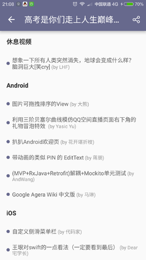

#GankMeiZhi
技术干货和福利图，一个IT技术资讯平台，能及时查看gank.io更新信息。各信息分类阅读，还能查看每天福利妹子图，还可以对信息进行收藏；使用第三方登录应用（新浪微博/QQ，微信暂不支持），数据来自代码家的干货网站
#开源库 
RxJava & Retrofit & glide & rxbinding(有点滥用[笑哭]) ... 学习ing
#下载APK： 
大家尽量 [应用宝](http://android.myapp.com/myapp/detail.htm?apkName=com.leaf.gankio) 下载,给个好评支持,Thank You Very Much！   其他：http://fir.im/GankMeiZhi
##感谢 
[drakeet](https://github.com/drakeet)  [代码家](https://github.com/daimajia)  [LiCola](https://github.com/LiCola) 等所有开源的开发者
##截图 
                
##说明 
转载/使用 请注明出处,谢谢！ 
有疑问请联系我 yeming_1001@163.com，权侵删. 
如果你觉得不错，可以帮忙分享给你更多的朋友，或请我喝瓶饮料(所谓的打赏QAQ)
## LICENSE 
Apache License
Version 2.0, January 2004
http://www.apache.org/licenses/
